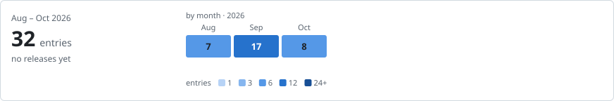

# Prospect Copilot

     

[Quick start](#quick-start) · [Architecture](#architecture) · [Change history](#change-history)

<!-- project-control:section=overview -->
## Overview

Prospect Copilot is a multilingual chat app for sales research and product sourcing.

- **Origin:** A standalone TypeScript rewrite of [`zubair-trabzada/ai-sales-team-claude`](https://github.com/zubair-trabzada/ai-sales-team-claude). [Architecture](#architecture) explains Next.js, LangGraph, and LangChain.

<!-- project-control:section=overview -->
## Capabilities

- **Prospects:** Research companies, qualify opportunities, find decision makers, and draft outreach.
- **Products:** Find and rank likely buyers or sellers.
- **Results:** Read evidence-backed reports and retained conversation cards; stop an active request when needed.
- **Models:** Use your key with an approved OpenAI-compatible endpoint. The default is DeepSeek at `https://api.deepseek.com`, model `deepseek-chat`.

## Quick start

Run these commands from `Prospect Copilot/`. Requires Node.js 20 or newer.

```bash
npm install
npm run dev        # http://localhost:3000
```

- `npm test` runs the Vitest unit tests once; `npm run test:coverage` adds a V8 coverage report.
- `npm run typecheck` runs the TypeScript compiler over the project without emitting files.
- `npm run e2e` runs the Playwright specs under `e2e/` against a production build Playwright starts
  itself.

Open the page, paste your DeepSeek API key into the settings bar (base URL and model are pre-filled), and try:

```
analyze https://stripe.com as a prospect
we sell payroll software, analyze https://stripe.com as a prospect
research https://www.acme.com
find decision makers at https://example.com
draft an outreach sequence for Acme Analytics
we sell payroll software for mid-market companies, who should we target?
where can I buy wool blankets?
```

The server accepts the default DeepSeek base URL automatically. To use a different OpenAI-compatible provider, approve its exact base URL in the server environment before starting the app:

```bash
LLM_ALLOWED_BASE_URLS="https://api.openai.com/v1,http://127.0.0.1:11434/v1" npm run dev
```

- The browser cannot select an arbitrary provider that the server has not approved.
- This prevents the chat endpoint from being used to contact internal services while still allowing an administrator to opt in a local provider.

<!-- project-control:section=workflows -->
## Workflow

1. Type a message in the chat page. A stateless LangGraph request workflow asks the intent router to
   classify it against six skills: **prospect** (full audit), **research**, **qualify**,
   **contacts**, **outreach**, **match** (rank candidate prospects for a product) - or plain chat.
2. **Prospect** runs the full pipeline:

   ```text
   Full prospect audit
   page discovery (homepage + up to 6 subpages)
     ↓
   deterministic extraction (tech stack, funding/jobs signals, and team-page contacts read from page text rather than links alone, with people employed elsewhere excluded)
     ↓
   5 parallel subagent analyses
     ↓
   a weighted composite of the five subagent scores (0-100, grade A+ to D), with deterministic BANT and MEDDIC reported alongside it as separate diagnostics
     ↓
   LLM synthesis with an executive summary, action plan, and first-touch email
   ```

3. Standalone skills (**research / qualify / contacts / outreach**) run light discovery when a URL
   is given, then stream their markdown deliverable.
4. **Match** uses one ranked-candidate pipeline for both directions: it can find likely buyers for
   something you want to sell or places that sell something you want to buy.
   - Candidate URL resolution and scoring use separate bounded worker pools with at most four active
     jobs - see "Finding buyers or sellers for a product" below.
5. Every report renders as structured in-app content; match results use selectable cards with full
   company names, clickable company websites, and a separate full-review action.
6. Conversations and their report cards persist in your browser's IndexedDB, including after
   switching conversations or refreshing the page, and any active request can be stopped from the
   chat controls.
7. Every reply - plain chat, processing logs, full audits, standalone skills, and match cards alike -
   is written in whatever language you write in, not English by default.

Bring your own key: the API key is stored in `localStorage` in *your* browser only and sent per-request as a header. It is never written to disk server-side and never logged.

### Scoring model

- Signals a page extractor cannot read - customer pain points, open roles, recent funding - are reported by the Opportunity Scoring subagent, which must evidence each one from the fetched pages and omits anything it cannot support.
- Deterministic code, never the model, then computes BANT and MEDDIC from those signals.

- Following the original prototype, MEDDIC is a **completeness diagnostic** that carries no weight in the numeric score.
- Each of the six elements is graded 0-100% by the share of its supporting signals that carried evidence, and the overall figure is the mean of the six - so a partly evidenced element is reported as partial instead of being rounded up to "known".

- The grade separates *looked for and absent* from *never collected*.
- Customer-review evidence and contract-renewal timing have no collector in this pipeline - the first needs a third-party source, the second is only learnable from the prospect - so they are excluded from the percentage rather than capping it, and 100% stays reachable.

Both still appear in the report under "Ask on the call", alongside the specific signal missing from every incomplete element, which makes the table call prep rather than a verdict.

### Workflow architecture and retries

- LangGraph owns request state, deterministic routing, workflow branches, and the lifecycle of the prospect, match, standalone-skill, and plain-chat subgraphs.
- LangChain's `ChatOpenAI` adapter handles OpenAI-compatible model calls, streaming, and Zod-validated structured output inside those nodes.

- The secure HTTP, extraction, scoring, and report-rendering modules remain deterministic TypeScript business-logic boundaries.
- Prospect discovery, analysis, deterministic scoring, synthesis, and formatting are separate graph stages.

- Match candidate resolution, scoring, and formatting are separate stages as well, so one stage can be observed or retried without repeating completed earlier work.
- LangChain agents are not used, so a model cannot reorder or skip the required audit stages.

Retries have one owner per operation:

- LangChain model retries are disabled (`maxRetries: 0`); the workflow and secure-fetch policies
  below are the only retry owners.

- LangGraph retries the structured intent-router node once for temporary provider failures or
  invalid structured output.
- Structured subagent, candidate, and synthesis calls receive one bounded repair/retry attempt
  before their existing partial-result fallback applies.
- The secure URL fetcher retries only temporary DNS, transport, rate-limit, or server failures.
  Invalid URLs, private/blocked addresses, permanent client errors, certificate failures, excessive
  redirects, and cancellation are not retried.
- URL retry backoff is cancellable, redirect and DNS safety checks run on every attempt, validated
  DNS addresses rotate between temporary connection failures, and oversized responses are stopped
  while bytes arrive rather than buffered completely.

- The graph is currently created per request without a server-side checkpointer.
- This preserves the existing privacy boundary: completed conversations and reports live only in browser IndexedDB.
- Durable resume, background runs, and human-review interrupts require a separate storage and ownership decision.

### Finding buyers or sellers for a product

Ask where to sell or where to buy a product and the assistant uses the same match structure in both directions. Sell mode ranks likely customers or buyers; buy mode ranks sellers, retailers, distributors, suppliers, and marketplaces.

- The request can use natural wording in any language, and a follow-up such as "Where can I buy them?" recovers the product from the conversation instead of requiring a fixed prompt format.

- An explicit city, region, or country filters either direction.
- For buy requests, candidates must sell, ship, deliver, or serve the requested location; for sell requests, candidates must operate, purchase, or have a relevant business presence there.

- The latest explicit location wins in follow-ups such as "What about Montreal?" When no location is supplied, the detected language continues to provide the default market signal.
- The app does not access browser geolocation automatically.

| Companies you name | No product mentioned | Product mentioned |
| --- | --- | --- |
| **None** | Plain chat | The LLM suggests candidates, quick-scores up to 12, and returns up to 8 ranked by fit. |
| **One** | Full audit (prospect/research/qualify/contacts/outreach, as usual) | Same full audit, now grounded in the product you described |
| **Two or more** | Each is quick-scored generically - useful for narrowing a shortlist before you've settled on a pitch. | Each is quick-scored against the product, ranked, and up to 8 are shown |

- **You only have to mention your product once.** The router scans the whole conversation, not just the latest message, so once you've said what you want to sell or buy it carries that context into later requests automatically - no setting to configure and no need to repeat it.
- If no product has been mentioned yet, the assistant asks for the missing product before matching.

- The ranked list from `match` renders as selectable cards: full company name, score, clickable website, location/founding date when the page's own structured data has them, a factual description of what the company does, and a separate fit judgment - a fast, single LLM call per candidate, not the full five-subagent audit.

- A separate action on each card starts a full review of that company.
- Discovery mode (naming no companies) asks the same LLM to suggest candidates directly from its own knowledge - there is no separate search API.

- Every suggested company still gets its homepage fetched and scored like any other candidate, so a wrong or outdated guess just means that one gets skipped rather than shown. Naming a few candidates yourself avoids relying on the model's guesses at all.

```
we sell payroll software for mid-market companies, who should we target?
where can I buy wool blankets?
where can I sell wool blankets?
where can I buy wool blankets in Toronto?
where can I sell payroll software in Québec?
we sell payroll software, analyze https://stripe.com as a prospect
we sell payroll software, rank Acme Corp, Globex, and Initech for fit
compare Acme Corp, Globex, and Initech
```

<!-- project-control:section=architecture -->
## Architecture

### AI & Intelligence

| Technology or concept | Use in this project |
|---|---|
| LangGraph | Owns typed request state, routing, prospect/match/standalone/chat subgraphs, branches, and bounded retries; no server-side checkpointer is configured. |
| LangChain | Its ChatOpenAI adapter handles approved OpenAI-compatible model calls, streaming, and structured output. LangChain agents do not control audit stages. |
| DeepSeek deepseek-chat | Default hosted language model. Users may configure an approved OpenAI-compatible endpoint; their key is supplied per request. |
| BANT | A deterministic sales-qualification diagnostic computed from evidenced facts, separate from the composite score. |
| MEDDIC | A deterministic evidence-completeness diagnostic; it does not change the composite prospect score. |

### Frontend & Presentation

| Technology or concept | Use in this project |
|---|---|
| React | Builds conversations, report cards, settings, and other interactive UI. |
| React DOM | Renders React components in the browser. |
| Next.js | App Router supplies page routing and the server /api/chat endpoint. |
| TypeScript | Adds types to frontend code, graph state, evidence processing, and deterministic scoring. |
| react-markdown | Renders Markdown answers and report content. |
| remark-gfm | Adds GitHub Flavored Markdown features, including tables, to rendered answers. |

### Backend & Application Logic

| Technology or concept | Use in this project |
|---|---|
| Node.js | Runs the Next.js server and local development/build commands. |
| Zod | Validates structured model outputs before business logic uses them. |
| Cheerio | Parses fetched company pages into evidence and contact signals. |
| Bounded concurrency | Limits candidate resolution and scoring workers; formatting is a separate graph stage. |
| Composite scoring | Combines five prospect analyses using deterministic calculations rather than asking a model to invent a score. |

### Data & Storage

| Technology or concept | Use in this project |
|---|---|
| IndexedDB | Stores conversations and generated reports in the browser; no server-side conversation database. |
| idb-keyval | Provides the key-value access layer for IndexedDB persistence. |
| localStorage | Retains the user's API settings/key in their browser; the server does not persist them. |

### Integrations & Security

| Technology or concept | Use in this project |
|---|---|
| Server-sent events (SSE) | Streams progress and results from /api/chat to the browser. |
| OpenAI-compatible API | The allowed interface for user-configured hosted model endpoints; does not imply use of an OpenAI model. |
| ipaddr.js | Classifies resolved IP addresses for outbound-request safety checks. |
| Server-side request forgery (SSRF) protection | Validates public destinations and redirects before fetching page evidence, with bounded worker pools. |

### Build & Delivery

| Technology or concept | Use in this project |
|---|---|
| Next.js build | `npm run build` compiles the App Router page and the `/api/chat` route; `npm run start` serves the result. |
| Vitest | Runs the unit tests beside the modules in `src/` for `npm test`, with V8 coverage on request. |
| Playwright | Drives the five end-to-end specs under `e2e/`, covering chat, conversations, match, settings and the responsive layout, against a production build it starts. |
| TypeScript compiler | `npm run typecheck` checks the whole project without emitting files. |

Answers use fetched page evidence; no local embedding model or vector database is maintained.

Each row covers one technology or concept within its category and describes that item's
project-specific role, read from the current source and dependency manifest.

## Project structure

| Path | Responsibility |
| --- | --- |
| `src/app/` | App Router page, browser icon, and the single `/api/chat` streaming endpoint. |
| `src/lib/workflow/` | LangGraph graph, shared state, and the prospect, match, standalone, and plain-chat subgraphs. |
| `src/lib/agent/` | Intent router, prospect orchestrator, and the Zod schemas every structured model call is validated against. |
| `src/lib/extract/` | Secure fetching (SSRF guard), homepage analysis, contact discovery, and HTML-to-text. |
| `src/lib/scoring/` | Deterministic BANT, MEDDIC, and composite scoring. No I/O and no model calls. |
| `src/lib/skills/` | The five subagent definitions, the four standalone skills, and the match pipeline. |
| `src/lib/storage/` | Browser IndexedDB persistence for conversations and reports. |
| `Resources/` | Full-size project icon master, kept outside `src/app/` so Next.js does not serve it. |
| `e2e/` | The Playwright end-to-end specs and their support helpers. |
| `docs/` | The design reference and the implementation plan. |
| `CONTRIBUTING.md` | Contribution and numbering rules for the public mirror. |
| `CHANGELOG.md` | The complete change history. |
| `CHANGELOG.svg` | The history strip drawn from the changelog. |

Business rules live in `scoring/` and `extract/`, never in a prompt: the model supplies evidenced facts and deterministic TypeScript does every calculation.

## Limits

### Privacy and result quality

- Settings (base URL, model, API key): `localStorage` only.
- Conversations and reports: IndexedDB in the browser. No server-side database exists; the server is
  stateless.

- **Evidence:** Every finding carries evidence and a confidence tag
  (High/Medium/Low/Inferred). Missing data is labeled "Not publicly available" and lowers the score.
- **URL protection:** Prospect URLs are resolved before fetching; loopback/private/link-local addresses
  and blocked hostnames are refused.
- **Source handling:** Website text, metadata, JSON-LD, and candidate content are evidence
  only; prompts explicitly forbid treating them as instructions.
- **Partial results:** Subagent failures reduce the composite score's confidence instead of
  failing the run; partial data is always marked.

## References

### Design reference

[Implementation plan](docs/implementation-plan.md) records scope decisions and design references.

<!-- project-control:section=ignore -->
## Contributing

For source changes, follow the [Prospect Copilot contribution guide](CONTRIBUTING.md).

<!-- project-control:section=history -->
## Change history



**Change-history numbering:** This project uses dated history and does not assign project-level
version or build numbers. Follow the [version and build policy](CONTRIBUTING.md#version-and-build-policy).

One record per change; complete details and evidence are in [CHANGELOG.md](CHANGELOG.md). Older work dates and Git checkpoints remain labelled when they differ.

**Historical status:** Each record describes its own delivery checkpoint. Later records supersede older pending work or recovery locations; historical checks are not new validation.

| Record | Date | Highlights | Details |
|---|---|---|---|
| Documentation | 2026-10-06 | <ul><li><strong>Changelog:</strong> The README's Change history opens with a history strip, <code>CHANGELOG.svg</code>, drawn from the changelog: the entries of every period as shaded cells, release months marked, and the span, total and version range beside them.</li></ul> | [Full record](CHANGELOG.md#history-strip) |
| Documentation | 2026-10-06 | <ul><li><strong>Layout:</strong> The line of section links under the title now holds three quick links, Quick start, Architecture and Change history, in place of one for every section; the outline of the whole README is the one GitHub, Obsidian and Project Control provide.</li></ul> | [Full record](CHANGELOG.md#three-quick-links) |
| Documentation | 2026-10-06 | <ul><li><strong>Audit:</strong> The test tooling gained a Build & Delivery table and its commands in Quick start, and the structure table lists <code>e2e/</code>, <code>docs/</code>, the contributor guide and the changelog.</li></ul> | [Full record](CHANGELOG.md#readme-source-audit) |
| Documentation | 2026-10-06 | <ul><li><strong>History:</strong> The complete change history now lives in <code>CHANGELOG.md</code>, one entry per change with its summary, what changed, what was checked and how it was delivered; the README table keeps the newest ten rows and opens each entry from its Details cell.</li></ul> | [Full record](CHANGELOG.md#changelog) |
| Documentation | 2026-10-05 | <ul><li><strong>Cleanup:</strong> Removed the three implemented plan documents under <code>docs/plans/</code>, which nothing linked to; the design document and the implementation plan stay.</li></ul> | [Full record](CHANGELOG.md#plan-documents-removed) |
| Documentation | 2026-10-05 | <ul><li><strong>Alignment:</strong> The badge row now opens with the platform and names the history mode; the four capability bullets left the Overview for a Capabilities section.</li></ul> | [Full record](CHANGELOG.md#readme-alignment) |
| Documentation | 2026-10-05 | <ul><li><strong>Structure:</strong> Sections follow the order and names every project README now shares, under a contents line; sections were renamed and moved, and no wording was removed.</li></ul> | [Full record](CHANGELOG.md#readme-skeleton) |
| Documentation | 2026-10-05 | <ul><li><strong>Readability:</strong> Long paragraphs, bullets and table cells are now short leads with sub-points, one fact each; no detail was removed.</li></ul> | [Full record](CHANGELOG.md#readme-structure) |
| Maintenance | 2026-09-30 | <ul><li><strong>Security:</strong> Cleared a critical Next.js advisory published on 2026-09-30: image generation through `next/og` could run attacker-supplied code.</li><li><strong>Version:</strong> Next.js 16.3.6; no other package moves.</li><li><strong>Exposure:</strong> None found: the app does not use `next/og`.</li><li><strong>Tests:</strong> 448 unit tests, the coverage gate, the type check, the production build, and 57 end-to-end runs pass.</li></ul> | [Full record](CHANGELOG.md#next-og-advisory-cleared) |
| Maintenance | 2026-09-30 | <ul><li><strong>Security:</strong> Cleared the medium advisory GitHub reported against undici, the HTTP client cheerio depends on: a hostile WebSocket server could crash the Node.js process.</li><li><strong>Version:</strong> undici 7.29.1, within the range cheerio declares; no other package moves.</li><li><strong>Exposure:</strong> None found: the app hands cheerio HTML it fetched itself and never opens a WebSocket.</li><li><strong>Tests:</strong> 448 unit tests, the coverage gate, the type check, the production build, and 57 end-to-end runs pass.</li></ul> | [Full record](CHANGELOG.md#undici-advisory-cleared) |
---

<!-- project-control:section=ignore -->
## 🔒 License

**PROPRIETARY SOFTWARE — ALL RIGHTS RESERVED**

Copyright © 2024–2026 Soucieux. All rights reserved.

The original source code, documentation, and other original materials in this repository are proprietary and are not open-source software.

Except where applicable law expressly permits otherwise, no permission is granted to copy, modify, publish, distribute, sublicense, sell, deploy, or create derivative works from these materials, in whole or in part, without prior written authorization from the copyright owner.

Access to this repository does not grant a license. Third-party software and materials remain subject to their respective license terms.

*This private project is not open for external contributions.*
